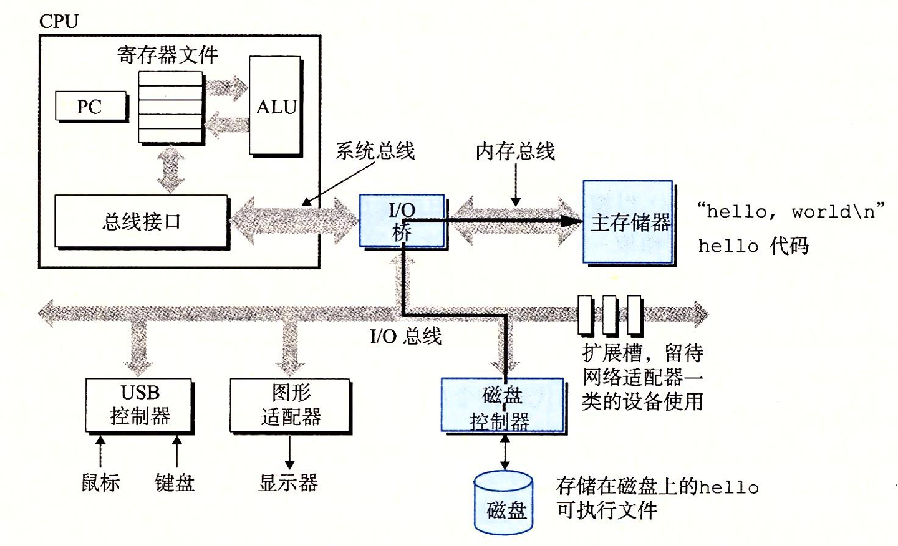
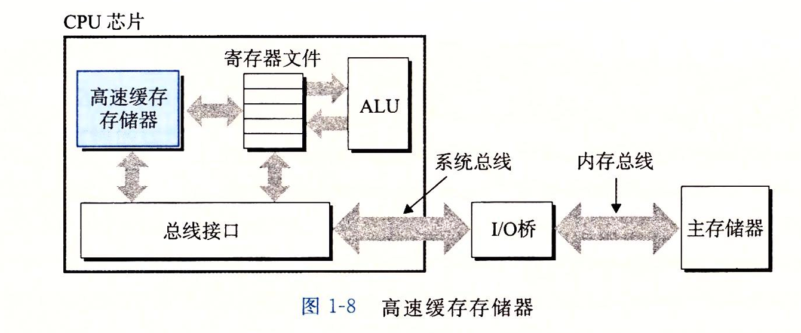

## 信息表示和处理
### 1.源程序到目标程序需要经历的四个步骤
- 预处理之后得到修改后的源程序(.i) ：加入头文件中包含的头文件

- 编译器得到汇编程序（.s）

- 汇编程序由汇编器处理得到可重定位目标程序（二进制.o）

- 由链接器链接得到可执行目标程序

### 2.了解编译工作的好处
- 优化程序性能

- 理解连接时出现的错误

- 避免安全漏洞

### 3.系统硬件的组成

1.**总线** ：贯穿整个系统的一组电子管道（携带信息字节并负责在各个部件间传递）

2.**i/O设备** ：系统和外界联通的通道（键盘 鼠标 显示器 磁盘驱动器）

3.**主存** ：临时存储设备 用于在处理器执行程序时 用来存放程序和程序处理的数据  由*一组动态随机存取存储器(DRAM)* 芯片组成

4.**处理器 -- CPU** 解释存储在主存中指令的引擎 其核心是一个大小为一个字节的***寄存器***   处理器一直在不断地执行程序计数器指向的指令，更新程序计数器，在指向下一条指令  该模型由*指令集架构* 决定的

> cpu 在指令的要求下可能会执行的操作
> > **加载**：从主存复制一个字节或者一个字到寄存器,以覆盖寄存器原来的内容。
> > 
> > **存储**：从寄存器复制一个字节或者一个字到主存的某个位置,以覆盖这个位置上原来的内容。
> > 
> > **操作**：把两个寄存器的内容复制到ALU, ALU对这两个字做算术运算,并将结果存放到一个寄存器中,以覆盖该寄存器中原来的内容。
> > 
> > **跳转**：从指令本身中抽取一个字,并将这个字复制到程序计数器(PC)中,以覆盖 PC中原来的值。

### 4.运行指令

### 5.高速缓存（CACHE）

- *小*而*快速*的存储设备 是存储在更大、也更慢的设备中的数据对象的**缓冲区域**
- 目的：
> 1.减少对底层慢速存储层（如硬盘或远程服务器）的访问次数,从而**提高数据检索的性能**
>  2.解决 CPU 速度与主存（DRAM）速度之间日益增大的差距
- **特点**：基于 SRAM（静态 RAM）技术实现，速度比 DRAM 快得多，但容量小、成本高
- **机制**：使用缓存的过程被称为**缓存**，存储器层次结构中的每一层都缓存来自较低一层的数据
>1.请求：系统请求特定的数据
>2.首先会在当前层缓存中查找
>3.若无，则从磁盘、慢速数据库中查找
>
 |概念|描述|结果|
 |--- ------|------------------------|------------------------------------------|
 |缓存命中|数据正好缓存在第k层中|直接从k层读取（快）|
 |缓存未命中|第k层中没有缓存对像|从k + 1 层取出包含在其中的数据，存储在k层里
> 4. 数据取回后再次回到缓存
- **缓存未命中** ：未命中会花费额外的时间，（
